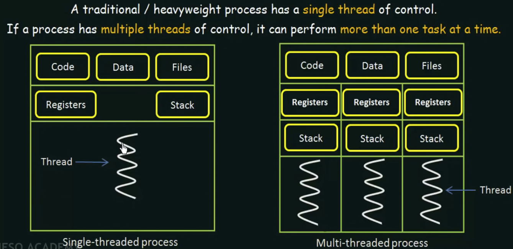

# JS 는 싱글스레드인가? 멀티스레드인가? 

## Thread
- 프로세스 내에서 실행되는 여러 흐름의 단위이며, 프로세스가 할당받은 시스템 자원 (CPU 시간, 메모리 영역 등)을 이용하는 실행 단위이다. 
- Thread 는 프로세스 내에서 각각 Stack만 따로 할당받고 Code, Data, Heap 영역은 공유한다. 

### 프로세스의 메모리
- 프로세스는 프로그램이 실행되는 즉시 CPU 로부터 할당받는 자원 영역이다 (메모리 등)
- 프로세스의 메모리는 크게 Code, Data, BSS, Heap, Stack의 영역으로 나뉜다. 
	- Code: 가장 하단에 위치한 영역이며, 작성한 기계어 또는 코드가 들어간다. 함수, 제어문, 상수 등이 들어간다. Read-only 영역이며, 컴파일러가 만든 코드라고 봐도 무방하다.  
	- Data: 전역변수, 정적변수, 배열, 구조체 등이 저장되는 공간이다. 또한, 초기화 (initialized) 된 데이터가 저장되는 공간이다. 즉, 초기값이 있는 static 변수가 들어간다. 
	- BSS (Block-stated Symbol): 초기화되지 않은 (초기값이 없는) 데이터가 저장된다. 
		- Code, Data, BSS 모두 정적인 영역이며, compile time 에 킉가 결정되어 이후에 변동되지 않는다. 또한, 프로세스가 종료될 때까지 계속 작동한다.
	- Heap: 프로그래머가 동적으로 사용하는 영역으로, 동적 객체 데이터의 할당 또는 반환이 이루어지는 영역이다.
	- Stack: 함수가 포함되어 있고, 함수 내의 지역변수, 매개변수 등이 저장되어 있는, 프로그램이 자동으로 사용하는 임시 메모리이다. LIFO 정책을 사용하며, 함수 호출 시 생성되고 함수 종료시 반환된다. 
		- Heap 의 영역이 증가하여 Stack 영역을 침범하는 Heap Overflow 의 상황이 되거나, Stack 의 영역이 증가하여 Heap 의 영역을 침범하는 Stack Overflow 의 상황이 될 때 사용되는 메모리의 자유 영역 또한 존재한다. 
- 속도는 Stack > Data > Code > Heap 순이다. 

- 앞서 언급했듯, Thread 는 프로세스 내에서 각각 Stack만 따로 할당받고 Code, Data, Heap 영역은 공유한다. 따라서 힙 메모리는 서로 읽고 쓸 수 있으며, 한 스레드가 자원을 변경하면 다른 이웃 스레드도 그 결과를 즉시 볼 수 있다. 

## 싱글, 멀티 스레드
- 전통적인 컴퓨터는 전부 single thread 로 이루어졌지만, 점차 multi-thread 프로세싱이 가능한 컴퓨터가 많아지고 있다. 
- Single Thread:
	- 하나의 프로세스에서 하나의 스레드를 실행하므로, 프로세스 내의 작업을 순차적으로 실행한다.
- Multi Thread: 
	- 각각의 스레드가 다른 작업을 할당받으므로, 프로세스가 병렬적으로 여러 작업을 동시에 수행할 수 있다.  
	- 장점: 
		- Responsiveness: 유저와 상호작용하는 애플리케이션의 경우, 한 가지 작업으로 인해 원하는 작업 수행이 더뎌지지 않는 경험을 하게 된다. 
		- Resource Sharing: Multi-thread 는 프로세스에서 공유하는 영역이 있다. 각 스레드별로 다른 메모리 주소가 필요하지 않기 때문에 메모리 사용이 효율적이다.

- 참고: Register 는 Stack 의 최상단 값의 주소를 추적하는 포인터이다. 

## Javascript 는 Single-threaded 인가?
- 자바스크립트를 작동시키는 핵심 엔진은 바로 콜 스택과 이벤트 큐로 구성된 이벤트 루프인데, 이 이벤트 루프는 싱글 쓰레드이다. 이 때문에 자바스크릡트를 싱글 쓰레드 언어라고 부른다. 
- 이것이 의미하는 가장 큰 바는, 코드를 순차적으로 실행한다는 점이다. 즉, 이전 라인에 작성된 코드 실행이 완료되지 않았는데 다음 코드로 넘어가지 않는다는 점이다. 
- 그러나 자바스크립트가 NodeJS 나 웹 브라우저와 같은 멀티 쓰레드 환경에서 실행되는데, "자바스크립트 런타임" 은 싱글 스레드가 아니라고 할 수 있다. 

## Nodejs 는 정말 Multi-threaded 인가? 
- Node 역시 하나의 프로그램이기 때문에, 실행 즉시 하나의 독립된 프로세스가 되어 CPU 로부터 리소스를 할당받는다.
- Node 에서 js 를 실행하면 콜백을 통해 여러 개의 함수를 실행할 수 있으며, fs.readfile 또는 DNS read 과 같은 작업들도 할 수 있다.
- 그러나 이러한 작업의 문제점은, 이벤트 루프에 큰 부담을 주어 결과적으로 애플리케이션의 성능을 줄일 수 있다는 것이다.
- 이를 해결하기 위해 Nodejs 는 uvlib 라는 C library 를 사용하기 시작한다. 해당 라이브러리는 스레딩을 지원한다. 
	- uvlib 는 I/O-intensive 작업과 CPU-intensive 작업을 지원한다.
	- I/O-intensive: DNS, File System 관련
	- CPU-intensive: Crypto, Zlib 관련 
- Nodejs 가 uvlib 를 사용하는 상황:
	- DNS 쿼리: host 의 ip 를 읽어야 하는 상황에서는 메인 스레드인 이벤트 루프를 사용하지 않고 새로운 스레드를 만들어 작업을 수행한다. (fetch 등)
	- File system: async file system 작업을 할 때 이벤트 루프에서 자체적으로 새로운 스레드로 작업을 넘긴다. (readfilesync 와 같은 동기 함수는 이벤트 루프에 들어간다!)
	- Crypto: 암호화 작업, 해싱 작업 또한 스레드를 활용한다. 
	- Zlip: 무언가가 압축될 때 역시 스레드를 활용한다. 
- 스레드 수를 무조건 늘려놓고 작업을 수행하는 것이 아니라, 어느 상황에서 어떻게 스레드가 trigger 되는지 파악하고 이에 맞춰 pooling 작업을 하는 것이 중요하다. 
- 중요한 POINT 몇 가지:
	- res.end 등, networking 관련 작업은 항상! 메인 스레드를 활용한다.
	- 서버의 코드를 작성할 때 해당 코드의 작업이 이벤트 루프에서 이루어지는지, 다른 스레드에서 이루어지는지 판단하는 것은 매우! 중요하다. 때에 따라서 이벤트 루프에서 작업되는 무거운 코드로 인해 영영 응답을 받지 못할 수도 있다... (ex while vs fs.read)

### 정리:
- 간혹 Nodejs 도 single-thread 라는 글이 보이는데, 아마 이러한 특징 때문에 빚어진 혼선 아닐까 싶다. Nodejs 는 기본적으로 Javascript 의 이벤트 루프를 메인 쓰레드로 활용하지만, 그 외에 다른 작업 스레드가 필요한 작업이 발생할 경우에는 새로운 스레드를 생성하여 실행할 수 있는 multi-thread 프로세스이다. 

## 알아두면 좋은 용어:
- I/O: 입력(Input)/출력(Output)의 약자로, 컴퓨터 및 주변장치에 대하여 데이터를 전송하는 프로그램, 운영 혹은 장치 

## 배운 점:
- 컴퓨터의 메모리를 확실하게 알아두어야 스레드와 프로세스의 개념을 심화하여 이해할 수 있을 것이며. 이를 위해서는 포인터 (pointer) 개념에 대한 이해가 필요하다. 메모리에 대한 직접적인 접근을 하는 컴파일 언어를 배워야 한다는 생각이 든다. 
- 내가 여태 Nodejs 와 Javascript 의 깊은 차이점까지는 이해하지 못했다는 것을 느꼈다. 런타임과 언어의 차이를 더욱 파 보아야겠다. 

### 참고자료:
- [When is NodeJS Single-Threaded and when is it Multi-Threaded?](https://youtu.be/gMtchRodC2I)
- [메모리 영역(Code, Data, Heap, Stack)](https://box0830.tistory.com/150)
- [메모리 영역의 이해](https://donghwada.tistory.com/entry/%EB%A9%94%EB%AA%A8%EB%A6%AC-%EC%98%81%EC%97%AD-Code-Data-BSS-HEAP-Stack-Little-Endian-Stack%EC%9D%98-%EC%9D%B4%ED%95%B4)
- [시스템 해킹 강좌 5강 - 메모리 구조 이해하기 (System Hacking Tutorial 2017 #5)](https://youtu.be/TxWOaKE5w_s)
- [Introduction to Threads](https://www.youtube.com/watch?v=LOfGJcVnvAk&ab_channel=NesoAcademy)