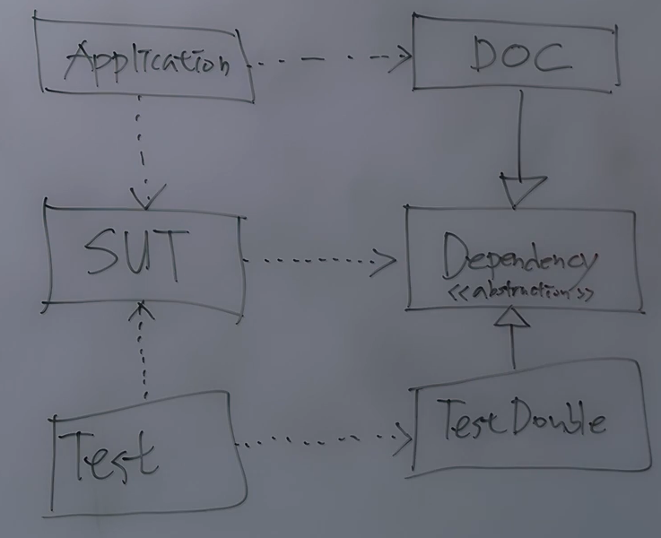

# TDD 심화

## 환경 변화와 적응력
- 경제적 변화에 대응하는 코드 작성법? 적응력이 높은 코드는 환경 변화에 따라 수정하는 코드의 범위도 적다. 
- 모듈화가 충실히 잘 되어 있으면 분리하기 쉽고, 새로운 코드를 확장하거나 기존 코드를 교체하고 버리기 쉽다. 

## 테스트 대역
- 실제 운영 코드를 대체하는 대역 코드 
- DOC (Depended on Component) : 테스트하려는 대상 코드 (SUT - system under testing) 가 의존하는 코드 

### 테스트 대역 유형
- Dummy: 특정 시나리오에서는 사용되지 않는 경우의 대역
  - Test Double 중 가장 단순한 형태
  - ex) 분기문을 가지고 있고 if () 상황에서만 dependency 사용하는 경우, dummy 사용
- Stub : 간접 입력의 대역
  - 외부에서 주입된 의존성이 출력하는 미리 준비된 답  
- Spy : 간접 출력의 대역
  - SUT 내부로 들어가서, SUT 가 간접 출력하면 가지고 있다가 올바르게 출력했는지 확인 
- Mock : SUT 내부의 상호작용을 검증하는 대역 
- Fake : 의존성 계약을 준수하는 가벼운 구현체 (ex 인메모리 DB)