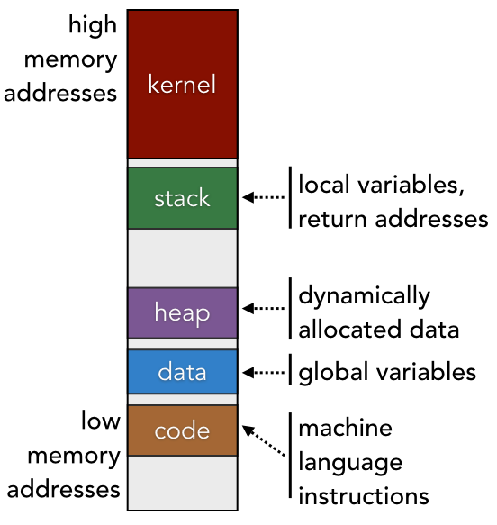

# CH1: From Programming Languages to Program Execution — How It All Works

## 1.1 What If You Invented a Programming Language?
* Switches are composed of 0s and 1s, capable of expressing simple boolean logic.
* A collection of switches, called the CPU, can perform only simple data transfer and arithmetic operations — but at incredibly high speeds.
* Evolution of Computers:
  * **Genesis:** Using punched cards, humans directly wrote instructions made up of 0s and 1s.
  * **Early Stage:** The appearance of **assembly language**, which mapped machine instructions to specific operations, represented with human-readable words.
    * e.g., `add`, `sub`, `mov`
    * Programs were used to translate these human-readable instructions into binary code that the CPU could understand.
  * **Middle Stage:** The transition from low-level to high-level languages.
    * Repetitive patterns in low-level instructions were expressed using *syntax*.
    * Code was structured as a *syntax tree*, where the result of child nodes is passed to their parent nodes.
    * To automatically convert human abstract expressions into concrete CPU-executable implementations, the **compiler** was invented.
  * **Later Stage:** The birth of interpreted languages.
    * Each CPU has its own unique instruction set, so an executable created for one platform (e.g., x86, ARM) cannot run on another.
    * To solve this, a **virtual machine** or **interpreter** was created — a program that defines a standard instruction set and emulates CPU execution behavior.
    * Flow of execution: code → standard instructions → interpreter for each CPU → CPU
    * Based on this idea, languages such as C/C++, Java, and Python were developed.

## 1.2 How Does a Compiler Work?
* A **compiler** is a program that translates a high-level language into a low-level language.
* A text file that contains code is called a **source file**.
* The compiler converts the source file into an **executable file**, which consists of machine instructions that the CPU can execute.
* The translation process:
  * **Lexical Analysis:** Extracts tokens from each element of the source code.
  * **Parsing:** Processes the conditions required to execute each syntactic token.
  * **Syntax Analysis:** Builds a tree structure (syntax tree) from the parsed result.
  * **Semantic Analysis:** Checks for compilation errors and ensures logical consistency.
  * **Intermediate Representation (IR) Generation:** Creates a refined form of code by traversing the syntax tree (some optimizations may also occur during this step).
  ```cpp
  // Source Code
  int a = 1;
  int b = 2;
  while (a < b)
  {
  	b = b - 1;
  }

  // IR Code
  a = 1
  b = 2
  goto B
  A: b = b - 1
  B: if a < b goto A
  ```
  * IR Code → Assembly Code conversion:
  ```cpp
  	.text
  	.globl main
  main:
  	pushq	%rbp
  	movq	%rsp, %rbp

  	# a = 1
  	movl	$0x1, -0x4(%rbp)

  	# b = 2
  	movl	$0x2, -0x8(%rbp)

  	jmp	.LB		# goto B

  .LA:
  	# b = b - 1
  	movl	-0x8(%rbp), %eax
  	subl	$0x1, %eax
  	movl	%eax, -0x8(%rbp)

  .LB:
  	# if (a < b) goto A
  	movl	-0x4(%rbp), %eax
  	cmpl	-0x8(%rbp), %eax
  	jl	.LA		# jump if a < b

  	# function return
  	movl	$0x0, %eax
  	popq	%rbp
  	ret
  ```
  * The **assembly code** is then translated into **machine instructions**.
* The source code is stored in a `.c` file, and the machine instructions are stored in an **object file** (`.o`).
  * Each source file corresponds to its own object file.
  * When there are many source files, the number of object files increases accordingly.
  * The process of combining multiple object files into a single executable is called **linking**, and the program that performs this task is the **linker**.

## 1.3 The Linker’s Untold Secrets
* The role of the **linker** is to combine multiple object files generated by the compiler into a single final executable file.
  * During this process, it verifies that **dependencies** are correctly set.
  * **Symbol Resolution:** A referenced external symbol must have exactly one implementation across all modules. The linker finds this single definition and connects it to all references.
  * The linker also performs **relocation**, which replaces temporary memory addresses with actual addresses in the final executable.

* **Steps of the Linking Process**
## Linking Process Steps

1. **Symbol Resolution**
   * **What is a symbol?** Any variable name that includes global variables and function names.
   * Local variables are used only within their own module and are not referenced by external modules, so the linker **does not care about them**.
   * The linker checks whether every external symbol referenced by an object file has a corresponding definition, and ensures that this definition exists **exactly once**.
   * The linker receives two types of information from the compiler:
     * Symbols **defined** in the source file that may be referenced by other modules
     * Symbols the source file **references** that are defined elsewhere
   * Each object file consists of two major sections:
     * **Data Section:** Stores global variables defined in the source file
     * **Code Section (Text Section):** Stores machine instructions generated from functions defined in the source file
   * The compiler delegates the task of finding definitions of externally defined global variables or functions to the linker; instead, it creates a **symbol table**.
     * The symbol table contains:
       * Symbols *defined* by this module
       * External symbols *referenced* by this module
     * The symbol table is also stored inside the object file.
   * **Symbol resolution** = ensuring that each external symbol referenced by an object file can be matched to a single, unique definition in the symbol tables.

2. **Executable File Generation**
   * **Static Libraries**
     * `.lib` on Windows, `.a` on Linux
     * Individual source files can be compiled separately and then linked together into a single static library.
     * When generating an executable, the necessary parts of the static library are copied into the executable (this is **static linking**).
   * **Static Linking**
     * The linker merges the elements of each object file (code section / data section):
       * Object A code section + Object B code section + Object C code section
       * Object A data section + Object B data section + Object C data section
     * The resulting executable also has code and data sections.
     * The executable contains a special symbol called **`_start`** → the CPU begins execution from the address of this symbol to run the initial machine instructions needed to start the program.
     * After those instructions run, the program eventually transitions into the execution of the `main` function.
    * **Dynamic Libraries**
     * Limitations of Static Linking

        * The static library code is copied directly into every executable that uses it
        → results in disk and memory waste
        * When the static library is updated, all dependent executables must be rebuilt

---

### 3.2 Overview of Dynamic Libraries

* Also called: **Shared Library / Dynamic Linked Library (DLL)**
* File extensions:

  * Windows: `.dll`
  * Linux: `.so` (typically prefixed with `lib`)

---

### 3.3 Data/Code Handling Differences

#### Static Libraries

* Code and data sections are copied into the executable **at compile time**
* The executable contains:

  * library code
  * library data
  * other object code

#### Dynamic Libraries

* Only minimal information is embedded into the executable:

  * library name
  * symbol table
  * relocation information
* The executable becomes smaller
* The remaining linking is performed **at runtime** (dynamic linking)


---

## 3.4 Dynamic Linking

Dynamic linking can be performed in two primary ways:

### 1) Dynamic Linking at Load Time

* **Loading**: The executable is read from disk and placed into a specific region of memory.
* This task is handled by a dedicated process called the **loader**.
* After loading the executable, the loader checks whether the program depends on dynamic libraries.
* If dependencies are found, the loader invokes the **dynamic linker**, which:

  * verifies the existence and location of dynamic libraries
  * resolves symbol addresses in memory
* After the dynamic linking process completes, the program begins execution.
* **❗ If the required dynamic library does not exist, the program terminates with an error.**


### 2) Dynamic Linking at Runtime

* The program begins execution first, and dynamic linking occurs during **runtime**
  (from the start of execution until the program ends).
* The program does **not** need to know its dynamic library dependencies prior to execution.
* The executable does **not** store dynamic library information internally.
* The application directly loads dynamic libraries when needed using APIs such as:

  * `dlopen`
  * `dlsym`
  * `dlclose`

- **Advantages of dynamic libraries**
  - Memory savings
  - Easier program upgrades and bug fixes
  - Convenient for developing with multiple programming languages

- **Disadvantages of dynamic libraries**
  - Lower performance compared to static linking (due to runtime linking)
  - Cannot access absolute memory addresses
  - The executable alone cannot run the program (dependency on external libraries)

- You can check the dynamic libraries an executable depends on using the `ldd` command.


3. **Relocation**

- Every variable and function has a memory address, and assembly language calls that address.

```cpp
  call 0x123456 // -> means “jump to this location”
```

* When the compiler generates an object file, it does **not** know what memory address to place after `call` (because it cannot know where the function will be loaded in memory).

* At this stage, it only records that a call should be made using a placeholder value.

  ```cpp
  call 0x00
  ```

* The linker must fill this empty part, but how does it know which function should be replaced with which runtime memory address?

* The compiler makes use of the following files:

  * `relo.text` → stores instructions for which the memory address cannot be determined yet
  * `relo.data` → stores the data associated with those instructions

    * Example: “Found symbol **xx** at an offset of **n bytes** from the start of the code segment”

- The linker reads the `relo.text` section and updates each instruction in the corresponding segments with the correct memory addresses.
- The addresses of variables and instructions change every time a program runs and are only known at runtime. How can the linker determine them in advance? → **Virtual Memory**
- Memory and Virtual Memory

  

  - When a program is executed, a process for that program is loaded into memory.
  - The stack resides at the higher end of the memory address space.
  - After execution, all programs start their code segment at memory address `0x400000` (on 64-bit systems), and the size is the same for all programs  
    → this is **logical (virtual) memory**, not physical memory.
  - Thanks to this standardized memory layout, the linker can determine symbol addresses when creating the executable  
    (without worrying about actual physical memory, basing its decisions on virtual memory addresses instead).
  - When the executable is loaded into physical memory, **memory mapping** is applied  
    (managed in page-sized units via the page table).
    - Example: virtual memory `0x400000` → physical memory `0x80ef0000`
    - Each process has its own page table.
  - The size of physical memory is independent of the size of virtual memory, and physical memory does not distinguish regions such as heap or stack.

