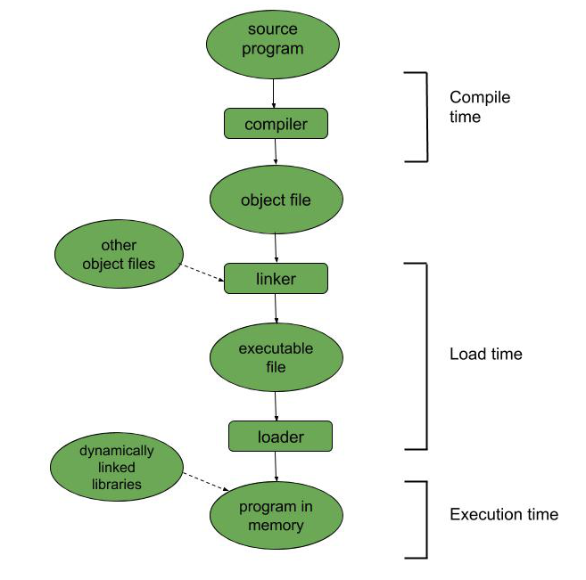

# CH2: The Program Is Running, but I Don’t Understand What’s Going On at All

## 2.1 Understanding Operating Systems, Processes, and Threads from the Ground Up

### 2.1.1 Everything Starts with the CPU
- The CPU (1) fetches an instruction from memory (dispatch), (2) executes the instruction, and repeats this process.
- Then, based on what criteria does it fetch instructions from memory?
- **PC (Program Counter)**
  - One of the CPU registers
  - Stores the address of the next instruction in memory
  - Example: if instructions are stored at memory addresses 101–102–103, and the CPU executes the instruction at 101, the PC will store 102
  - The address stored in the PC is automatically incremented by 1 by default, but in the case of if-else statements or function calls, the PC value is dynamically changed based on:
    - the result of CPU operations, or
    - the target jump address specified by the instruction
    
  - In the image above, the executable file resides on disk, and the CPU reads instructions from memory.
  - How is the initial PC value set?
  - **`main` function**
    - When a program starts, the CPU first locates the first machine instruction corresponding to `main`
    - That memory address is written into the PC

### 2.1.2 From the CPU to the Operating System

- The CPU can do only one task at a time, but it can make it *appear* as if multiple programs are running simultaneously.
- Run A → pause A → run B → pause B … if these switches happen fast enough, it looks like concurrent execution. This is **multitasking**.
- When a switch occurs, doesn’t the state (context) of the running program get lost?
  - Which machine instruction was being executed
  - What values were stored in each register
  - etc.
- To prevent loss, the entire context is stored in a structure called a **process**.
  - In other words, every program is managed as a process once it starts running.
- The tool that manages programs as processes and automatically loads them into memory is the **Operating System (OS)**.

### 2.1.3 Processes Are Great, but Still Inconvenient

- The OS makes it appear as if each process exclusively owns a standard-sized memory space.
- A process address space consists of the following regions:
  - **Code segment:** machine instructions generated by compiling code
  - **Data segment:** global variables
  - **Heap segment:** memory returned by `malloc`
  - **Stack segment:** runtime call stack for function execution
- In a program with a single execution flow, calling two long-running functions sequentially causes unnecessary delays.
- To solve this, each function can be executed in a separate process and the results combined afterward.
- However, this requires **multi-process programming** and **inter-process communication (IPC)**.
  - Process creation is expensive, causing significant overhead
  - Each process has its own memory space, so adding IPC makes the system complex

### 2.1.4 Evolution from Processes to Threads

- When a program starts, the PC register stores the address of the `main` function, creating a single execution flow as instructions run.
- However, the PC register can point to functions other than `main`, creating additional execution flows.
- In this case, they share the same process address space, so IPC is unnecessary.
- A single process can contain multiple execution flows, and each execution flow is called a **thread**.
- Threads reside within the same process rather than separate address spaces, so they **share the address space**.
- Since IPC is unnecessary, threads are much lighter and faster than processes  
  → threads = **lightweight processes**
- Sharing the same memory address space provides convenience but also introduces problems:
  - Issues with shared resource access in multi-threaded environments
  - The CPU executes instructions without awareness of threads (it does not consider which thread an instruction belongs to)
- **Mutual exclusion** and **synchronization** are used to solve these problems

### 2.1.5 Multithreading and Memory Structure

- What is the relationship between threads and memory?
- Information required for function execution — function parameters, local variables, return addresses, etc.
  - This information is stored in a **stack frame**.
- Every function has its own runtime stack frame when it executes.
- Each time a function is called or returns, the stack frame grows or shrinks in **Last-In, First-Out (LIFO)** order  
  → forming the **stack segment** in the process address space.
- A process with a single execution flow needs only one stack segment.
- However, if a process has multiple execution flows, it requires multiple stack segments.
  - The process address space must contain a **separate stack segment for each thread**.

### 2.1.6 Examples of Thread Usage

- Types of tasks handled by threads: long-running tasks / short-running tasks
- Long-running tasks:
  - A thread is created when the task starts and terminated when the task ends  
  - Example: working on a word processing document
- Short-running tasks:
  - General tasks with short processing time  
  - Example: network requests, database queries
- A common way to handle multiple tasks: **thread-per-request**
  - A new thread is created for each incoming request
  - Works very well for long-running tasks
  - For a large number of short-running tasks:
    - Significant time is wasted
    - Each thread uses an independent stack segment, increasing resource consumption
    - Overhead from frequent context switching increases

### 2.1.7 How a Thread Pool Works

- Thread pool approach:
  - Multiple threads are created in advance
  - When a task arrives, it is assigned to an available thread
- Since threads are pre-created:
  - No unnecessary creation/destruction overhead
  - Reduced memory usage
- Uses a queue data structure
  - **Producer–consumer pattern**:
    - producer: submits tasks
    - consumer: processes tasks
- Tasks submitted to the thread pool consist of:
  - (1) the data to be processed
  - (2) the function that processes the data

### 2.1.8 Number of Threads in a Thread Pool

- If the number of threads is too small:
  - The CPU cannot be fully utilized
- If the number of threads is too large:
  - System performance degrades
  - Excessive memory usage
  - Increased overhead from thread context switching
- The optimal number of threads depends on the type of workload handled by the thread pool (from a resource perspective):
  - **CPU-intensive tasks**
    - Scientific computations, matrix-heavy operations
  - **I/O-intensive tasks**
    - Spend most of the time waiting for disk or network I/O
    - Should be evaluated using performance testing tools with metrics such as:
      - WT (Wait Time — I/O waiting time)
      - CT (Computing Time — CPU computation time)
    - For a system with **N cores**, an appropriate number of threads:
      - `N × (1 + WT / CT)`

## 2.2 Process Resources Shared Between Threads

### 2.2.1 Thread-Private Resources

- From the perspective of state transitions, a thread is ultimately the execution of a single function.
- Each thread has its own **private stack region**.
- Information related to a function’s execution state is stored in a **stack frame**, which resides in the stack region.
- A stack frame contains various **thread-private information**, such as:
  - Initial values of registers used by the function
  - Local variables
  - Stack pointer
  - Program counter
  - and more
- All of this information is referred to as the **thread context**.
- These constitute **thread-private resources**.
- All remaining resources in the process are **shared among threads**.

### 2.2.2 Code Segment: Any Function Can Be Executed on a Thread
-   The code segment stores executable machine instructions generated
    after compiling the program
-   The code segment is read-only, and no thread can modify its contents
    while the program is running (thread-safe)

### 2.2.3 Data Segment: All Threads Can Access Variables in the Data Segment
-   The data segment stores global variables
``` cpp
char c; // global variable

void func() {

}
```
-   Since all threads share the same process address space, they can
    access variables in the data segment
-   Global variables are shared resources and require synchronization
    when modified

### 2.2.4 Heap Segment: Pointers Are the Key
-   Memory requested with `malloc` or the `new` keyword is allocated in
    this region
-   As long as a thread has the pointer (memory address), it can access
    the corresponding data
-   The heap is shared among threads, so concurrent access requires
    synchronization

### 2.2.5 Stack Segment: Private Data Within Shared Space
-   Threads within the same process are loosely isolated, so one thread
    can read and write data in another thread's stack region
-   This has a very high risk of causing errors
-   Even though each thread has its own stack segment, all memory still
    belongs to the same process

### 2.2.6 Dynamic Linking and Files
-   Static linking
    -   All dependent libraries are included in the executable file
        (code and data included)
    -   No additional work is required at program startup
-   Dynamic linking
    -   The executable file does not include dependent library code and
        data
    -   During execution, the required code and data are located and
        loaded into the process address space
    -   The address space needed during dynamic linking is placed in the
        unused region between the stack and the heap

### 2.2.7 Thread-Local Storage
-   Thread local storage
-   Variables stored in this region can be accessed by all threads, but
    each thread owns its own instance
-   Even if one thread modifies the variable, the change is not
    reflected in other threads

```cpp
__thread int a = 1;  // thread-local storage

void print_a()
{
    cout << a << endl;
}

void run()
{
    ++a;
    print_a();
}

void main()
{
    thread t1(run);
    t1.join();
    thread t2(run);
    t2.join();
}

// Output:
// 2
// 2
```
-   The modification made in thread t1 does not affect t2
-   From t1's perspective, a becomes 2 after incrementing
-   From t2's perspective, a is still 1 before incrementing
-   After initialization, each thread has its own copy of the variable

## 2.3 How Should We Write Thread-Safe Code?

### 2.3.1 Freedom and Constraints
-   If a thread uses only its own private data, it is thread-safe
-   When a thread uses shared resources, it must follow constraints that
    prevent affecting other threads in order to remain thread-safe


### 2.3.2 What Does Thread-Safe Mean?
-   Being thread-safe means that the code always produces the correct
    result regardless of the number of threads or their execution order

``` cpp
// Example

int func() {
    int a = 1;
    int b = 2;
    
    return a + b;
}
```
-   To write thread-safe code, you must identify which resources are
    private and which are shared
-   You must distinguish between heap, stack, data, and code segments

### 2.3.3 Thread-Private Resources and Shared Resources
-   Thread-private resources
    -   Local variables
    -   A thread's stack region
    -   Thread-local storage
-   Shared resources
    -   Heap segment
    -   Data segment
-   Threads using shared resources must follow an execution order
-   Operations on shared resources must not interfere with other threads
-   What are the different ways to implement thread safety?

### 2.3.4 Using Only Thread-Private Resources
``` cpp
int func() {
    int a = 1;
    int b = 2;
    
    return a + b;
}
```
-   This function uses only local variables, which are thread-private
    resources
-   These variables are managed in the stack segment
-   Such code is also called a stateless function

### 2.3.5 Thread-Private Resources and Function Parameters
``` cpp
// call by value 

int func(int num) {
    num++;
    
    return num;
}
```
-   In the case of call by value, there is no issue
-   The parameter passed by value is stored in the stack segment
``` cpp
// call by reference

int func(int* num) {
    num++;
    
    return num;
}
```
-   Passing a pointer using call by reference can cause problems
-   If the pointer refers to a global variable, multiple threads may
    modify the same shared resource

### 2.3.6 Using Global Variables
-   There are situations where a thread must use shared resources
-   If a global variable is initialized once at program startup and all
    code only reads it, there is no issue
-   If a global variable is both read and written, it is not thread-safe

### 2.3.7 Thread-Local Storage
``` cpp
__thread int global_num = 100;

int func() {
    global_num++;
    
    return global_num;
}
```
-   If the `__thread` specifier is used, the variable is placed in
    thread-local storage
-   Even if one thread modifies the value, it does not affect other
    threads

### 2.3.8 Function Return Values
``` cpp
int func() {
    int a = 100;
    
    return a; // return by value
}

int* func() {
    static int a = 100;
    
    return &a; // return by reference
}
```
-   If a function that returns a reference value is called in a
    multithreaded environment, another thread may modify the variable
    before it is used
-   If a static local variable is used, it is stored in the data
    segment, and any thread that obtains its address can modify it
-   The Singleton pattern can be applied to prevent errors

### 2.3.9 Calling Non-Thread-Safe Code
``` cpp
// NOT thread-safe 

int global_num = 0;

int func() {
    global_num++;
    
    return global_num;
}

// thread-safe

int funcA() {
    mutex l;
    
    l.lock();
    func();
    l.unlock();
}
```
-   Thread safety can be guaranteed by protecting the call to `func()`
    with a lock

### 2.3.10 How to Implement Thread-Safe Code
-   In multithreaded programming, resources should be shared as little
    as possible
-   If resources must be shared, identify thread-private and shared
    resources, then take the following measures
    -   Use thread-local storage
    -   Apply read-only design
    -   Use atomic operations (atomic operations cannot be interrupted
        midway)
    -   Use mutual exclusion and synchronization mechanisms (mutex,
        spinlock, semaphore)

## 2.4 How Should Programmers Understand Coroutines?
-   So far, the focus has been on kernel threads
-   In kernel threads, thread creation, scheduling, and termination are
    all handled by the operating system, and the programmer is not
    directly involved
-   Implementing threads without relying on the operating system is
    called a coroutine

### 2.4.1 Normal Function
``` python
def func():
    print("a")
    print("b")
    print("c")
    
def foo():
    func()
    
# Output:
a
b
c
```

### 2.4.2 From Normal Function to Coroutine
-   A coroutine has pause and resume capabilities
``` python
def func():
    print("a")
    yield
    print("b")
    yield
    print("c")
    
def foo():
    func()
```
-   When `func` runs as a coroutine, it returns to the caller at each
    `yield`
-   Difference from `return`: after a `return` statement, there is no
    way to continue executing the function
-   A coroutine can save its execution state, so it can continue running
    even after returning
-   Each time the caller resumes the coroutine, execution continues from
    the last suspended point
-   When a coroutine yields, its execution information is saved in the
    stack area
-   Pause and return is generally implemented using `yield`
``` python
def func():
    print("a")
    yield
    print("b")
    yield
    print("c")
    
def foo():
    co = func()  # obtain coroutine
    next(co)     # start coroutine
    print("in function A")
    next(co)     # resume coroutine
    
# Output
a
in function A
b
```

### 2.4.3 Intuitive Explanation of Coroutines
-   Normal function: control flow is caller → function → caller
-   Coroutine: caller → function → caller → function (resume point) →
    caller

### 2.4.4 A Function Is Just a Special Case of a Coroutine
-   This is similar to how the operating system schedules threads
    (thread pause → OS saves execution state → schedules another thread
    → paused thread resumes when CPU is allocated again)
-   The computer system periodically generates timer interrupts, and
    each time an interrupt is handled, the operating system decides
    whether to suspend the current thread
-   In user mode, there is no interrupt-based mechanism like in kernel
    mode, so coroutines must explicitly yield to pause and reassign
    resources
-   No matter how many coroutines are created, they are implemented in
    user mode, and the operating system is not aware of them

### 2.4.5 History of Coroutines

### 2.4.6 How Are Coroutines Implemented?
- A coroutine must record its state information when it is suspended and use it to resume execution later
- The state information includes 1. CPU register state 2. function execution state
- The coroutine stack frame information is stored in the heap area

## 2.5 Thoroughly Understanding Callback Functions

### 2.5.1 Everything Begins with a Requirement

### 2.5.2 Why Callbacks Are Needed
- By treating functions like variables, we can pass a user-defined function instead of continuously modifying code to meet every new requirement
```cpp
void make_donut(func f) {
    f();
}

// past
int main() {
    if (donutA) {
        make_A();
    }
    else if (donutB) {
        make_B();
    }
}

// callback
int main() {
    make_donut(callback_from_anywhere);
}
```

### 2.5.3 Asynchronous Callback
- If the callback is executed in a new thread, the main thread can immediately continue executing the next line

### 2.5.4 Asynchronous Callbacks Lead to a New Programming Mindset
- Synchronous call = call a function, obtain the result, then process it
- Asynchronous call = one thread calls the function, while another thread (or process, or system) executes it

### 2.5.5 Definition of a Callback Function
- A callback function is executable code passed as a parameter to other code
- Even if I wrote the function, it may be called by an external module
- Callbacks are useful when the external module does not know in advance what action should be performed at a specific time
- Useful when registering a callback for a specific event (file transfer complete, data received, etc.)

### 2.5.6 Two Types of Callbacks
- Blocking callback = when func A is called with a callback parameter, and the callback executes before A returns
- Non-blocking (deferred) callback = func A returns immediately, and the callback executes later
    - The main program can continue running while the callback is pending

### 2.5.7 The Problem of Asynchronous Callbacks: Callback Hell
- When dozens or hundreds of callbacks are invoked, handling them asynchronously can easily lead to callback hell
```cpp
// synchronous
a = GetServiceA();
b = GetServiceB(a);
c = GetServiceC(b);

// asynchronous
GetServiceA(function(a) {
    GetServiceB(a, function(c) {
        // ...
    });
});
```

## 2.6 Thoroughly Understanding Synchrony and Asynchrony

### 2.6.1 The Hardworking Programmer
- The essence of an asynchronous scenario is that while the programmer works, the boss proceeds with other tasks, and once the job is done, the programmer simply reports back

### 2.6.2 Phone Calls and Email
- Phone call = synchronous
- Email = asynchronous

### 2.6.3 Synchronous Call
- In a synchronous call, if funcA calls funcB, funcA cannot continue until funcB finishes
- Both functions execute in the same thread
```cpp
funcA() {
    funcB();
}
```
- Exception: I/O operations such as file read; the thread is paused while the kernel performs the work
    - blocking I/O

### 2.6.4 Asynchronous Call
- If read is called asynchronously, it returns immediately even if the file read is not complete
- How can we detect when the work is actually completed? Two situations exist
    1. The caller does not care about the result
    2. The caller must know the result
        1. Use a callback function executed upon completion
        2. Use a notification mechanism to send a signal or message to the caller

### 2.6.5 Synchronous and Asynchronous Work in a Web Server
- If everything is executed synchronously, idle time appears in the main thread

## 2.7 Oh Right! There Are Also Blocking and Non-Blocking

### 2.7.1 Blocking and Non-Blocking
- Blocking and non-blocking are mainly discussed when calling functions
- If function A calls B and the OS suspends A’s thread or process, it is blocking
    - Otherwise, it is non-blocking
- The core of blocking is the suspension of a thread or process

### 2.7.2 The Core Problem of Blocking: I/O
- Blocking is usually related to I/O
- While one thread performs I/O, the OS transfers CPU control to another thread
- After I/O completes, CPU control is returned
- During this period, the thread is blocked

### 2.7.3 Non-Blocking and Asynchronous I/O
- When calling a non-blocking function such as `recv`, the OS does not suspend the thread and returns immediately
- The thread continues execution while the kernel continues handling data reception

### 2.7.4 Pizza Ordering Analogy
- Going to the store to order pizza directly = blocking
- Ordering by phone = non-blocking
    - However, if you keep calling every 5 minutes to check, it becomes synchronous rather than asynchronous

### 2.7.5 Synchrony and Blocking
- Synchronous → not necessarily blocking
- Blocking → necessarily synchronous

### 2.7.6 Asynchrony and Non-Blocking
- Asynchronous → not necessarily non-blocking
- Non-blocking → not necessarily asynchronous

## 2.8 Implementing a High-Concurrency, High-Performance Server

### 2.8.1 Multi-Process
- Using Linux `fork` to create multiple child processes
- Advantages
    - Simple
    - Each process has its own address space, so failures are isolated
    - Fully utilizes multi-core resources
- Disadvantages
    - Inter-process communication becomes more complex
    - Process creation overhead is high

### 2.8.2 Multi-Thread
- Creating multiple threads within a single process
- Advantages
    - Lightweight due to shared address space
    - Lower creation and termination overhead
- Disadvantages
    - If one thread crashes, the entire process may terminate
    - Shared resource data cannot be freely read and written simultaneously without synchronization

### 2.8.3 Event Loop and Event-Driven Programming
- Event-based concurrency, event-driven programming
- Wait for an event, then find and invoke the corresponding event handler
```cpp
while (true) {
    event = getEvent();
    handler(event);
}
```
- Problems
    1. How can multiple events be obtained?
    2. Should handlers run in the same thread?

### 2.8.4 First Problem: Event Sources and I/O Multiplexing
- I/O multiplexing
- In Linux, everything is treated as a file and handled via file descriptors
- How can multiple fds be monitored simultaneously instead of waiting indefinitely?
- `epoll` performs I/O multiplexing and monitors sockets, notifying when data arrives
```cpp
epoll_fd = epoll_create();
epoll_ctl(epoll_fd, EPOLL_CTL_ADD, fd1, &event1);
epoll_ctl(epoll_fd, EPOLL_CTL_ADD, fd2, &event2);

while (1) {
    int n = epoll_wait(epoll_fd, events, maxevents, -1);
    for (int i = 0; i < n; i++) {
        // event handling
    }
}
```

### 2.8.5 Second Problem: Event Loop and Multi-Thread

- If request processing takes only a short time, handling it in a single thread is acceptable; however, if it consumes significant CPU time, multi-threading becomes necessary
- Use worker threads to distribute incoming events to separate worker threads for processing
- Concurrent execution using multiple threads maximizes utilization of multi-core systems and accelerates request handling
- It can also be implemented using a thread pool
- This architecture is also known as the reactor pattern
